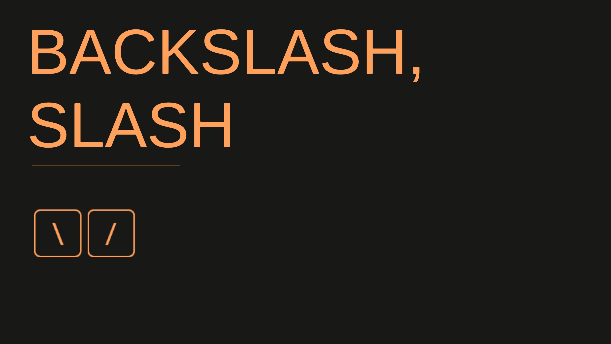
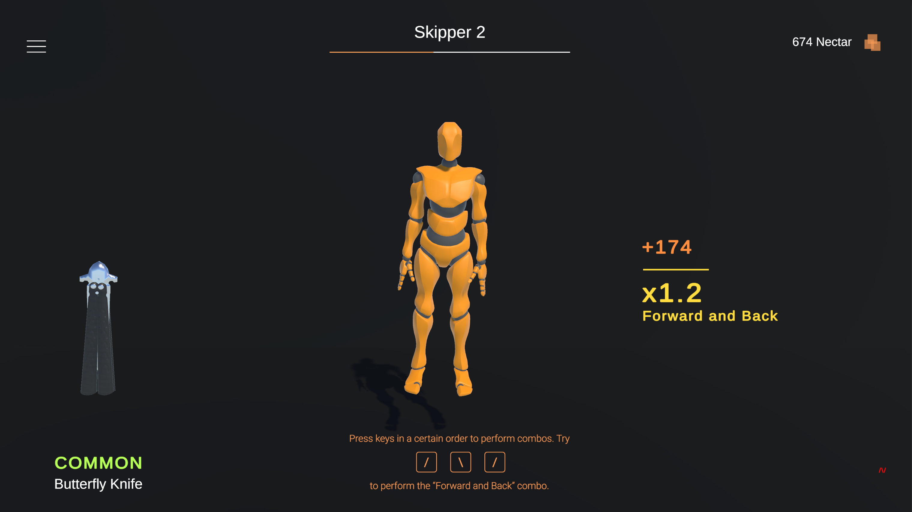
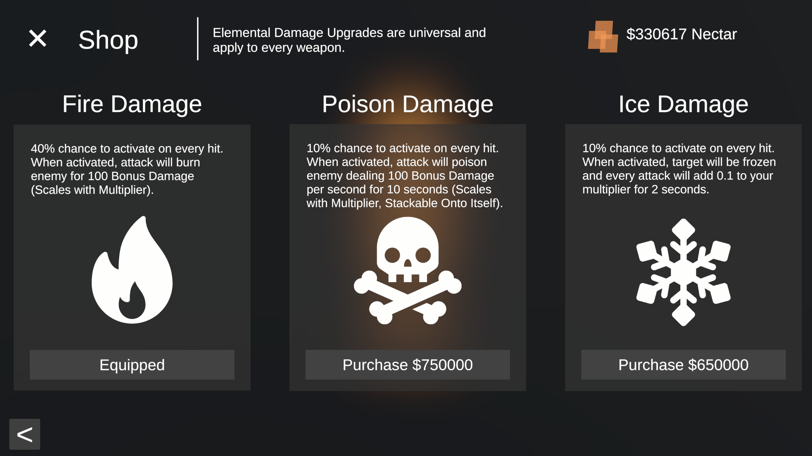
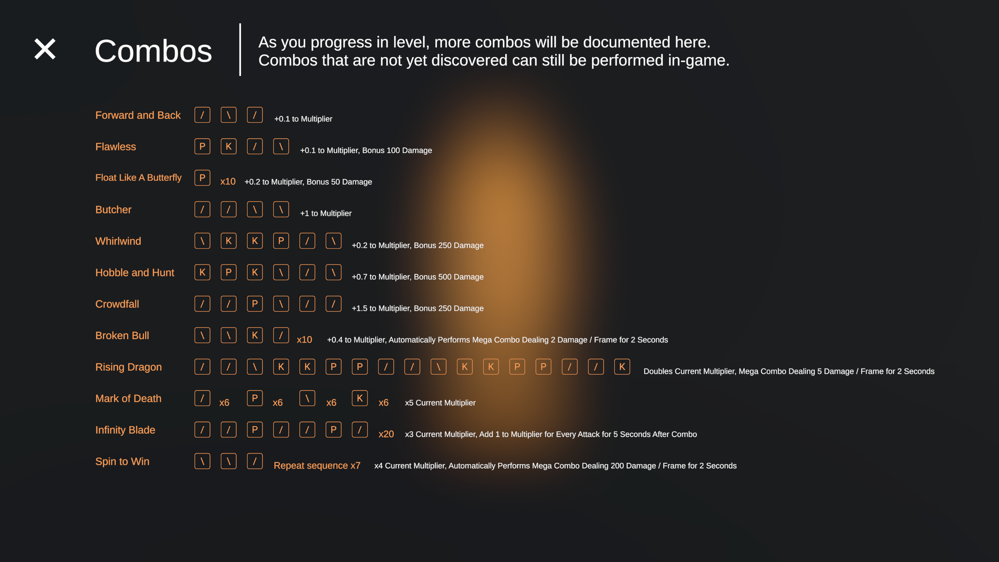
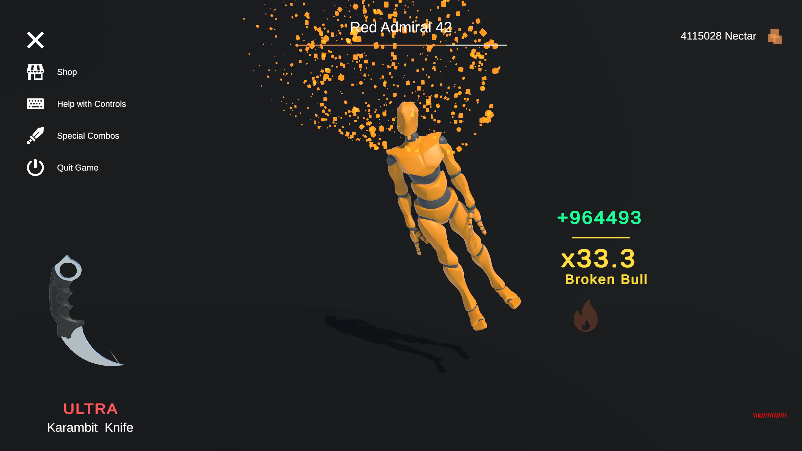

 
*Backslash, Slash* is a 3D Game developed in `Unity URP` for the **[48+8 2021](https://itch.io/jam/48-8-jam-2)** Game Jam. Players perform melee combos by pressing keys in unique sequences to grind out points, progress through levels, and upgrade their gear. The main goal is to chain together combos to deal massive damage and play satisfying animations!
 
If you simply want to try the game for yourself, visit our [Itch.io](https://justinlin905.itch.io/backslash-slash) page. Here, you can easily download the game and play within minutes.
 
For users looking to edit the project code, you will require a `Unity 2019.4.13` installation. Choose “Download ZIP” and extract the folder, then choose “Add” in Unity Hub. Select the “backslash-slash” folder as the project folder. **Please note that certain weapon models in this repository have been replaced with alternatives** because their license prohibits open-source sharing. The project hosted here is therefore slightly different from the game hosted on Itch.io.
 
*Backslash, Slash* was created in 48 hours during the **48+8 2021** Game Jam, where the theme was *Butterfly*. 
 
# Connection to Game Jam Theme
The rules of the 48+8 Game Jam state:
 
The theme is **Butterfly**. There's a lot of idioms, puns, phenomenon, and objects which incorporate "butterfly" in some way. All of those interpretations are allowed. Have fun with it!
 
Upon reading this theme, we decided to focus on a famous and ultra-cool weapon: the Butterfly Knife! Because of Muhammad Ali’s iconic quote “Float like a butterfly, sting like a bee”, we also decided to add punching and kicking into the game as an homage to martial arts. We also incorporated the theme by naming different levels after butterfly species, and changing the dummy colour to match the colour of these species. 
 
# Gameplay
 
The game opens with the Main Menu, where the player pushes `\` and `/` to start the game.
 
The player is walked through the basics of the controls with a tutorial. During this time, the player will learn how to perform their first combo, how combo mechanics work, and how to navigate the game.
 

 
By successfully performing combos, the player increases their damage multiplier. This will allow them to progress through levels and earn points (Nectar) more quickly. The player can use their points in the Shop to upgrade their knife, purchase a different type of knife, or purchase an elemental damage upgrade.
 

 
As the player progresses through the levels, instructions on how to perform new combos will be revealed in the Combos menu. Certain combos have unique bonuses which activate when they are performed.
 

 
Using upgraded gear and a knowledge of combinations, the player can stack damage to ludicrous levels. Attacking a ragdoll dummy has never been so satisfying!
 

 
## Notes
The folder named “ReadMeImages” contains screenshots which are displayed in this `README.md` file. These are not used in the project or game.
 
## Team
 
**Backslash, Slash** was created by 2 high school students:
 
* Justin Lin
 
* Yax Patel
 
# Attributions
 
**Butterfly Icon, Sword Icon, Snowflake Icon, On/Off Icon, Poison Icon, Shop Icon:**
 
Icons made by [Freepik](https://www.freepik.com) from [www.flaticon.com](https://www.flaticon.com/) 
 
**Fire Icon, X Icon:**
 
Icons made by [Those Icons](https://www.flaticon.com/authors/those-icons) from [www.flaticon.com](https://www.flaticon.com/) 
 
**Keyboard Icon:**
 
Icons made by [Gregor Cresnar](https://www.flaticon.com/authors/gregor-cresnar) from [www.flaticon.com](https://www.flaticon.com/) 
 
**Menu Icon:**
 
Icons made by [Pixel perfect](https://www.flaticon.com/authors/pixel-perfect) from [www.flaticon.com](https://www.flaticon.com/) 
 
**Cool Sunglasses Model:**
 
"Deal With It Sunglasses" (https://skfb.ly/6nAYO) by BitGem is licensed under Creative Commons Attribution (http://creativecommons.org/licenses/by/4.0/).
 
**Kawase Blur:**
Created by tomc128. GitHub Repository can be found at https://github.com/tomc128/urp-kawase-blur.
 
## We would like to thank the organizers of the 48 + 8 game jam for a fun and unique opportunity!
 

